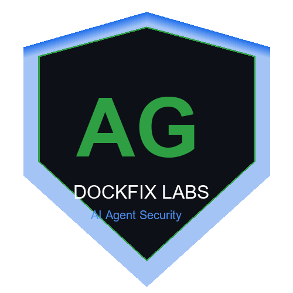

<p align="center">
  
</p>

<h1 align="center">Dockfix Labs</h1>

<p align="center">Building open-source security tools for the AI agent era</p>

<p align="center">
  <code>Agent Security</code> - <code>MCP Protocol</code> - <code>OWASP ASI Top 10</code> - <code>Developer Tooling</code>
</p>

---

<p align="center">
  <a href="https://pypi.org/project/dfx-agentguard/"></a>
  <a href="https://pypi.org/project/dfx-mcp-scanner/"></a>
  <a href="#"></a>
  <a href="#"></a>
</p>

---

### Flagship Projects

<table>
  <tr>
    <td width="50%" valign="top">
      <h3 align="center"><a href="https://github.com/dockfixlabs/agentguard"> AgentGuard</a></h3>
      <p align="center"><b>Autonomous security scanner for AI agents.</b> Detects prompt injection, tool abuse, data exfiltration, and all 10 OWASP ASI Top 10 vulnerabilities. MCP server mode included.</p>
      <p align="center">
        <a href="https://pypi.org/project/dfx-agentguard/"></a>
        
        
      </p>
    </td>
    <td width="50%" valign="top">
      <h3 align="center"><a href="https://github.com/dockfixlabs/mcp-scanner">" MCP Scanner</a></h3>
      <p align="center"><b>Security scanner for MCP servers.</b> Detects malicious tools, data exfiltration, and supply chain risks before you connect an MCP server to your AI agent.</p>
      <p align="center">
        <a href="https://pypi.org/project/dfx-mcp-scanner/"></a>
        
      </p>
    </td>
  </tr>
  <tr>
    <td width="50%" valign="top">
      <h3 align="center"><a href="https://github.com/dockfixlabs/agentguard-app">- AgentGuard App</a></h3>
      <p align="center"><b>GitHub App for automated PR reviews.</b> Scans every PR for AI agent security vulnerabilities and posts inline comments with OWASP ASI findings.</p>
      <p align="center">
        
        
      </p>
    </td>
    <td width="50%" valign="top">
      <h3 align="center"><a href="https://github.com/dockfixlabs/agentguard-vscode">" AgentGuard VS Code</a></h3>
      <p align="center"><b>VS Code extension.</b> Inline security diagnostics for AI agent code. Scan on save, findings tree, quick fixes.</p>
      <p align="center">
        
      </p>
    </td>
  </tr>
</table>

### " Install

```bash
pip install dfx-agentguard    # AI agent security scanner
pip install dfx-mcp-scanner   # MCP server security scanner
```

### " GitHub Stats

<p align="center">
  
  
</p>

###  Tech Stack

```
Python - TypeScript - JavaScript
GitHub Actions - FastAPI - MCP Protocol
OWASP ASI - VS Code - PyPI
```

### " Contact

- Open an issue on any repo
- Or reach out via [GitHub Discussions](https://github.com/dockfixlabs/agentguard/discussions)

---

<div align="center">
  <i>Securing the autonomous web.</i>
  <br/><br/>
  
</div>


